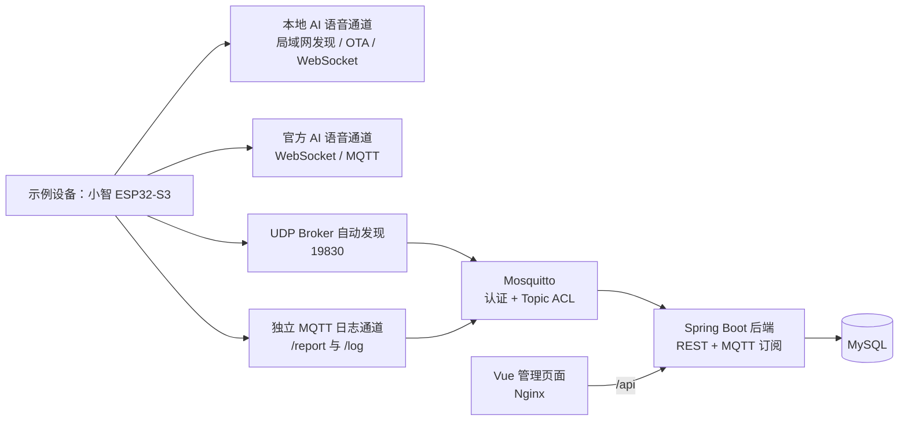
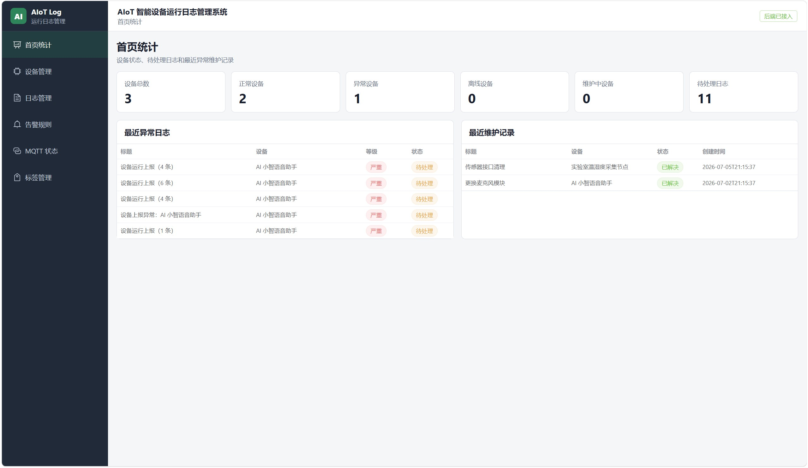
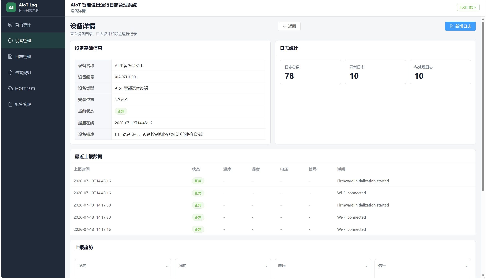
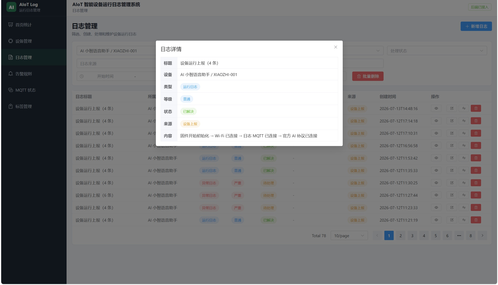
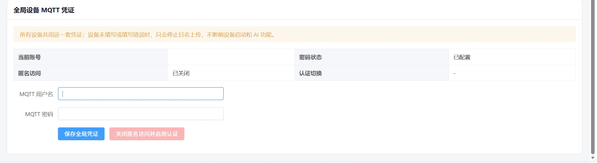
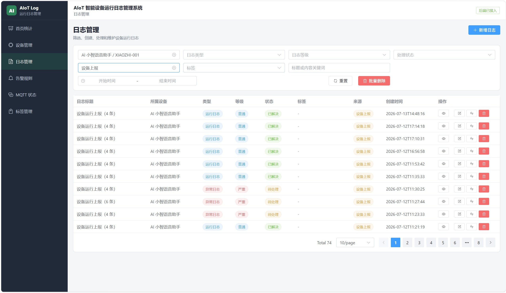

# AIoT-Log-System

> 面向局域网 AIoT 设备的运行日志与状态管理系统。系统提供设备数据上报、运行日志追踪、MQTT 管理和可视化后台；小智 ESP32-S3 是当前完成实机验证的设备接入示例。

[](#技术栈)
[](#技术栈)
[](#技术栈)
[](#技术栈)

## 项目简介

AIoT-Log-System 解决 AIoT 设备在日常运行中“状态分散、日志难追溯、局域网地址变化后接入困难”的问题。系统统一接收 HTTP/MQTT 设备上报，将关键运行事件沉淀为可筛选、可查看、可批量维护的中文日志，并在管理页面展示设备状态、最近上报和趋势数据。

系统的设备接入面向通用 MQTT、HTTP 与协议适配器场景；目前已使用 `XIAOZHI-001` 真实小智 ESP32-S3 完成局域网 MQTT 日志上报、Broker 自动发现、认证和 AI 双通道切换验收，作为一套完整的实机示例。

## 核心功能

- 设备、运行日志、标签和告警规则管理。
- 首页统计、设备详情、最近上报与温湿度/电压/信号趋势。
- 支持 HTTP `POST /api/device-reports` 与 MQTT `aiot/device/+/report` 状态上报。
- 支持 MQTT `aiot/device/+/log` 运行事件上报，自动写入 `DEVICE` 来源日志。
- 小智已知运行事件中文化展示；同一启动过程的连续事件可汇总为一条可读日志。
- 日志页面自动刷新；按需进入批量删除模式，并在删除前二次确认。
- UDP `19830` 自动发现同一局域网内的 Mosquitto Broker，适应 Wi-Fi、网线与手机热点的 DHCP 地址变化。
- Mosquitto 已关闭匿名访问，使用全局 MQTT 用户名密码认证与 Topic ACL。
- 当前源码提供按业务接口分组的 OpenAPI JSON 和 Swagger UI。
- API 错误响应提供稳定业务错误码和请求追踪号，便于前后端联调和日志定位。
- 提供本地开发脚本和 Docker Compose 四服务部署。

## 技术栈

| 层级 | 技术 |
| --- | --- |
| 前端 | Vue 3、TypeScript、Vite、Element Plus、Pinia、Vue Router、Axios |
| 后端 | Java 17、Spring Boot 3.3.5、MyBatis Plus、Eclipse Paho |
| 数据与消息 | MySQL 8.4、Mosquitto 2、MQTT |
| 部署 | Docker Compose、Nginx |
| 设备示例 | 小智 ESP32-S3、UDP 自动发现、MQTT |

## 架构

架构图源文件：[docs/architecture.mmd](docs/architecture.mmd)。GitHub 支持 Mermaid 时可直接渲染下图。



AI 对话和本地日志上报相互独立：日志 MQTT 异常不应阻塞小智的语音与 AI 通道。更完整的接入与部署说明见[项目设计](docs/project-design.md)。

## 启动与停止

本地开发版需要已安装并配置 Java 17、Node.js、MySQL 和 Mosquitto：

```text
start-all.cmd       启动本地开发环境
stop-all.cmd        停止本地开发环境
访问地址：http://127.0.0.1:5173/
```

Docker 版需要 Docker Desktop：

```text
docker-start.cmd    日常启动；同时更新当前局域网发现地址
docker-update.cmd   首次部署或代码更新后构建并启动
docker-stop.cmd     停止容器并保留数据
访问地址：http://127.0.0.1/
```

本地开发版和 Docker 版会同时使用 `3306`、`8080`、`1883`，**不能同时启动**。Docker 数据保存在命名卷中；不要在不了解影响时执行会删除数据卷的命令。

Docker 首次运行 `docker-update.cmd` 时会在本机生成 `.env` 和 `docker/local/`：其中包含随机数据库密码、MQTT 凭证、Mosquitto 密码文件及当前局域网 IPv4。这些文件均已被 `.gitignore` 忽略，**不要打开、复制、提交或上传**。局域网 UDP 自动发现默认不要求 Token，以便未预置 Token 的设备可自动获取 Broker 地址；如设备固件支持并配置了同一 Token，可在私有 `.env` 中手动设置 `MQTT_DISCOVERY_TOKEN`。脚本不会覆盖已存在的凭证；在切换 Wi-Fi、网线或热点后再次运行 `docker-start.cmd`，会更新仅供 UDP 发现使用的本机局域网地址。若电脑当前没有可用局域网 IPv4，Docker 仍可启动，但会暂时关闭 UDP 发现；联网后再次运行启动脚本即可恢复。Docker 也会使用 TCP `1883` 和 UDP `19830`，不要与本地开发版同时运行。

### 接口文档

当前源码构建的后端提供以下接口文档：

```text
Swagger UI：http://127.0.0.1:8080/swagger-ui.html
OpenAPI JSON：http://127.0.0.1:8080/v3/api-docs/aiot-api
```

群晖部署时将 `127.0.0.1:8080` 替换为 NAS 地址和后端宿主机映射端口，例如 `http://<NAS>:18080/swagger-ui.html`。文档仅限可信网络使用；可用 `OPENAPI_ENABLED=false` 和 `SWAGGER_UI_ENABLED=false` 关闭。当前已发布的 `v1.1.8-remote-mqtt` 尚不包含该功能，需要等待后续固定镜像。

API 失败时使用真实 HTTP 状态，并在响应体返回稳定的 `errorCode` 和 `traceId`；响应头 `X-Trace-Id` 可用于关联后端日志。客户端程序应判断 `errorCode`，不要依赖中文 `message`。

### HiveMQ Cloud 远程版本（`Remote-Hivemq` 分支）

该分支保留上述局域网模式，并增加可选的远程日志接入：设备通过 HiveMQ Cloud 的 TLS `8883` 上报，家中群晖/电脑上的后端主动订阅并写入 MySQL。远程模式不需要群晖公网 IP，也不应开放家庭 `1883`、`8080`、`3306` 或 UDP `19830` 到公网。

```text
docker-remote-update.cmd        首次构建并启动远程源码版
docker-remote-start.cmd         启动远程源码版
docker-remote-stop.cmd          停止远程源码版
docker-remote-ghcr-update.cmd   拉取并启动远程 GHCR 成品镜像版
```

首次运行会由初始化器生成被忽略的 `docker/local/hivemq-remote.env`，用户只在该私有文件中填写 `MQTT_BROKER_URL=ssl://<private-host>:8883`、`MQTT_USERNAME` 和 `MQTT_PASSWORD`；公开模板是 `config/hivemq-remote.env.example`。该文件与原局域网 Docker 的 `.env` 分离，切换模式不会覆盖原配置。远程 Compose 只运行 MySQL、后端和前端，不包含 Mosquitto、TCP `1883` 或 UDP `19830`。不要把私有配置、真实域名、凭证或设备数据提交、上传或截图公开。实现与验证状态见 [HiveMQ 远程版本记录](docs/hivemq-remote-mqtt-version.md)。

两个 GHCR 包同时保存局域网版和远程版：局域网版固定标签为 `v1.0.0-lan`，当前远程固定版本为 `v1.1.8-remote-mqtt`，在 `v1.1.7` 基础上接入 Flyway 数据库迁移；空库执行 V1，已有数据库保留数据并建立 V1 基线，后续结构升级使用 V2、V3 迁移。旧远程版继续保留用于回退。`latest` 保留给 `main` 的局域网版，且只有明确推送 `main` 分支时才允许更新；远程版本标签不会覆盖它。

```text
docker pull ghcr.io/yyj7890/aiot-log-backend:v1.1.8-remote-mqtt
docker pull ghcr.io/yyj7890/aiot-log-frontend:v1.1.8-remote-mqtt
```

### 首次本地配置（公开模板）

本仓库不提交真实凭证或本机运行配置。新环境可参考以下模板创建本地文件；模板中的 `<...>` 必须替换为仅保存在本机的值。

| 公开模板（可提交） | 本地文件（不可提交） |
| --- | --- |
| `backend/src/main/resources/application.example.yml` | `backend/src/main/resources/application.yml` |
| `config/mosquitto-lan.example.conf` | `config/mosquitto-lan.conf` |
| `config/mosquitto-acl.example.conf` | `config/mosquitto-acl.conf` |
| `config/mqtt-credentials.env.example` | `config/mqtt-credentials.env` |

请勿把模板直接用于生产，也不要把真实值写回模板。Mosquitto 密码文件始终仅保留在本机。

Docker 使用独立的 `docker/local/` 私有配置，不会修改上述本地开发配置。公开仓库中的 `.env.example` 仅说明变量名；如使用 Docker 脚本，无需手工填写真实值。

### 群晖 DSM / Container Manager 部署

当前 `docker-compose.yml` 是源码构建编排，不是只引用现成前后端镜像的清单。因此只有使用这份编排时，才需上传项目根目录（至少包含 `docker-compose.yml`、`backend/`、`frontend/`、`sql/`、`docker/`、`tools/`）。后端启动时由 Flyway 验证和升级数据库：空数据库执行 V1 建表，已有数据库第一次接入时登记为 V1 基线并保留原数据，后续结构变化按 V2、V3 迁移。`sql/schema.sql` 只作为已发布旧镜像和空 MySQL 数据卷的冻结 V1 兼容引导，不再承载后续结构变化；`sql/init-data.sql` 仅保留为本地演示数据，不会自动导入新用户数据库。

Container Manager 不会执行 Windows 的 `.cmd` / PowerShell 初始化脚本。首次创建项目之前，在 DSM 中启用 SSH，以管理员身份登录后先执行 `sudo -i`，再运行一次：

```sh
cd /volume1/docker/iot
sh tools/initialize-synology-docker-config.sh
```

脚本会在 NAS 上生成并复用私有 `.env` 与 `docker/local/`，包括随机数据库密码、MQTT 凭证、Mosquitto 密码哈希、ACL 和当前局域网 IPv4；不会输出密码。完成后，在 Container Manager 的“项目”中选择该目录的 `docker-compose.yml` 构建并启动。若 NAS 访问 Docker Hub 不稳定，可先在“注册表”拉取 `mysql:8.4`、`eclipse-mosquitto:2` 及前后端构建所需的基础镜像，再重新构建。

NAS 上同样只限可信局域网使用：不要将 `3306`、`1883`、`19830/UDP` 或管理网页端口转发到公网，也不要上传或共享生成的 `.env`、`docker/local/`。

如已在 Container Manager 拉取 `aiot-log-backend` 和 `aiot-log-frontend` 成品镜像，无需上传前后端源码。Windows 上运行 `tools/create-synology-image-deploy.ps1` 会生成一个只含成品镜像 Compose、冻结 V1 兼容结构、NAS 初始化脚本和说明的部署包及 ZIP；将其上传到 NAS 后按其中 `README.txt` 初始化，再用其 `docker-compose.yml` 创建项目。Flyway 迁移文件已经打包在后端镜像中，无需在 NAS 单独复制后续 V2、V3 SQL。

### 成品镜像部署（推荐给其他使用者）

当项目发布 GHCR 成品镜像后，使用者不需要 Java、Node.js、Maven，也不需要在本机编译前后端源码。安装 Docker Desktop、下载本仓库后，双击：

```text
docker-ghcr-update.cmd  首次拉取或更新 GHCR 成品镜像
docker-ghcr-start.cmd   日常启动已拉取的镜像
docker-ghcr-stop.cmd    停止 GHCR 部署并保留数据
```

这三个脚本会拉取 `ghcr.io/yyj7890/aiot-log-backend` 与 `ghcr.io/yyj7890/aiot-log-frontend`，其余 MySQL、Mosquitto 和本机私有配置仍由 Docker Compose 自动管理。首次发布后，仓库维护者必须在 GitHub 的 **Packages → 对应镜像 → Package settings** 将两个镜像设为 **Public**；否则其他人拉取时会被拒绝。使用者只能选择一套 Docker 脚本：源码构建版 `docker-*.cmd` 与成品镜像版 `docker-ghcr-*.cmd` 不要同时运行。

发布者向 `main` 推送后，GitHub Actions 会构建并推送 `latest` 与提交 SHA 标签；推送 `v1.0.0` 这类标签还会生成对应版本标签。需要固定版本时，在本机忽略的 `.env` 设置 `AIOT_IMAGE_TAG=v1.0.0`，不要把该私有 `.env` 上传。

## 真实设备接入示例：小智 ESP32-S3

以下流程以小智 ESP32-S3 为当前实机示例。其他设备可通过标准 MQTT、HTTP 或适配器/边缘网关接入同一后端，具体 Topic 与事件格式保持统一即可。

1. 先启动且仅启动一种运行方式（本地开发或 Docker），确认管理页面和 Mosquitto 可用。
2. 在可信局域网中放行设备与部署主机之间的 TCP `1883`、UDP `19830`；不要配置路由器端口转发或暴露至公网。
3. 为设备配置局域网访问条件。固件先通过 UDP `19830` 发现 Broker；发现失败时才使用手动 Broker 地址兜底。
4. 在 IoT 的 MQTT 状态页面创建或更新全局 MQTT 凭证，关闭匿名访问并重启相应服务使配置生效；然后在小智配网页保存相同凭证。不要把凭证填入仓库文件、截图或文档。
5. 设备周期状态发布到 `aiot/device/{deviceCode}/report`，关键运行事件发布到 `aiot/device/{deviceCode}/log`。例如设备启动、Wi-Fi 已连接、日志 MQTT 已连接、AI 协议状态等。
6. 在“设备详情”“日志管理”和“MQTT 状态”页面核对数据。运行日志会由后端汇总，并以中文展示已知事件。

设备未填写凭证或认证失败时，设计上只停止本地日志上传；AI 通道与设备启动不应被本地日志链路阻塞。

## MQTT 自动发现、认证与安全

- 自动发现仅面向设备与服务主机可互访的同一局域网。服务端只返回私有 IPv4；手机热点需关闭客户端隔离，否则 UDP 发现可能失败。
- 当前 Broker 使用一套全局设备用户名密码，匿名访问已关闭，并设置了通用 `report` / `log` Topic ACL。该方案适合家庭与开发联调，不等同于生产级设备隔离。
- 当前版本**不适合公网直接部署**：尚未启用 TLS，也尚未为每台设备分配独立凭证与最小权限 ACL。
- Docker 部署同样仅限可信局域网：首次启动自动生成并复用私有 MQTT 凭证，关闭匿名访问，同时发布 UDP `19830` 供局域网设备自动发现。不要在路由器或云安全组中将 `1883`、`19830`、`3306` 暴露到公网。
- 不提交真实 MQTT 用户名、密码、Token、Mosquitto 密码文件、真实 MAC/IP、运行日志、数据库数据或未脱敏截图。发布前逐项执行[安全检查清单](SECURITY-CHECKLIST.md)。

## 已完成的实机验证

- 示例设备 `XIAOZHI-001` 已通过独立 MQTT 日志通道向系统发布 `/report` 与 `/log`。
- 已验证普通 Wi-Fi、手机热点切换下的 UDP `19830` Broker 自动发现。
- 已验证网络临时断开后的 MQTT 重连与日志恢复。
- 已验证 MQTT 全局账号密码认证、关闭匿名访问后，设备仍能持续上报。
- 已验证启动事件汇总、中文运行日志、日志自动刷新和批量删除交互。
- 已验证本地 AI 可用时的实际 WebSocket 对话，以及本地 AI 不可用时回退官方 AI。

## 当前已知限制

- 全局 MQTT 凭证、无 TLS 的配置只限可信局域网；生产环境应升级为 TLS、每设备凭证和最小权限 ACL。
- 管理页面登录、HTTP 设备身份认证、自动化回归测试、成品镜像和在线演示尚未完成。
- 当前实机验证集中在小智 ESP32-S3 示例设备；其他设备类型、长期持续运行、多设备并发与大数据量性能仍待验证。
- 本地 AI 回退官方 AI 偏慢、本地 AI 能力较弱已记录为延期问题；本次不处理，后续需在小智固件或本地 AI 服务侧优化。

## 项目截图

### 首页统计



### 设备详情



### 中文运行日志



### MQTT 认证状态



### 批量删除模式



## 与官方小智固件项目的关系

本仓库是独立的通用 AIoT 日志管理与展示系统，负责 Mosquitto、Spring Boot、MySQL、Vue 管理后台及设备日志接入；小智仅是当前实机接入示例，不是系统主体，也不是官方小智固件的替代仓库。

小智 ESP32 固件应单独基于官方 [`78/xiaozhi-esp32`](https://github.com/78/xiaozhi-esp32) Fork 发布，并在该固件仓库中维护板型适配、局域网发现客户端、独立 MQTT 日志客户端和固件构建说明。两个项目通过标准 MQTT Topic 和约定的 JSON 事件格式集成。

## 文档与交付

- [项目设计](docs/project-design.md)：系统架构、接口、设备接入和部署。
- [当前状态](docs/project-status.md)：功能完成度、验证范围与限制。
- [开发记录](docs/development-log.md)：关键问题、修复和验收过程。
- [后续计划](docs/future-development-backlog.md)：待办与优先级。
- [技术决策](docs/technical-decisions.md)：选型和发布决策。
- [架构图源文件](docs/architecture.mmd)：可维护 Mermaid 源。
- [发布前安全检查清单](SECURITY-CHECKLIST.md)：提交或上传 GitHub 前必查项。
