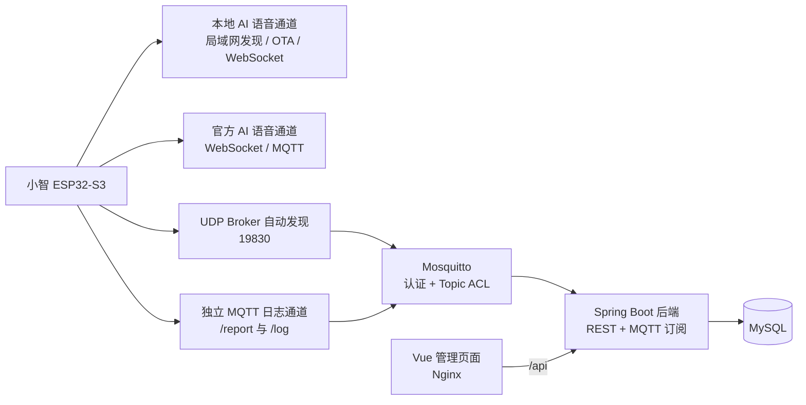

# AIoT-Log-System

> 面向局域网智能设备的运行日志与状态管理系统。以小智 ESP32-S3 为实机接入示例，提供设备数据上报、运行日志追踪、MQTT 管理和可视化后台。

[](#技术栈)
[](#技术栈)
[](#技术栈)
[](#技术栈)

## 项目简介

AIoT-Log-System 解决智能设备在日常运行中“状态分散、日志难追溯、局域网地址变化后接入困难”的问题。系统统一接收 HTTP/MQTT 设备上报，将关键运行事件沉淀为可筛选、可查看、可批量维护的中文日志，并在管理页面展示设备状态、最近上报和趋势数据。

本项目已使用 `XIAOZHI-001` 真实小智 ESP32-S3 设备完成局域网 MQTT 日志上报、Broker 自动发现、认证和 AI 双通道切换验收。

## 核心功能

- 设备、运行日志、标签和告警规则管理。
- 首页统计、设备详情、最近上报与温湿度/电压/信号趋势。
- 支持 HTTP `POST /api/device-reports` 与 MQTT `aiot/device/+/report` 状态上报。
- 支持 MQTT `aiot/device/+/log` 运行事件上报，自动写入 `DEVICE` 来源日志。
- 小智已知运行事件中文化展示；同一启动过程的连续事件可汇总为一条可读日志。
- 日志页面自动刷新；按需进入批量删除模式，并在删除前二次确认。
- UDP `19830` 自动发现同一局域网内的 Mosquitto Broker，适应 Wi-Fi、网线与手机热点的 DHCP 地址变化。
- Mosquitto 已关闭匿名访问，使用全局 MQTT 用户名密码认证与 Topic ACL。
- 提供本地开发脚本和 Docker Compose 四服务部署。

## 技术栈

| 层级 | 技术 |
| --- | --- |
| 前端 | Vue 3、TypeScript、Vite、Element Plus、Pinia、Vue Router、Axios |
| 后端 | Java 17、Spring Boot 3.3.5、MyBatis Plus、Eclipse Paho |
| 数据与消息 | MySQL 8.4、Mosquitto 2、MQTT |
| 部署 | Docker Compose、Nginx |
| 设备示例 | 小智 ESP32-S3、UDP 自动发现、MQTT |

## 架构

架构图源文件：[docs/architecture.mmd](docs/architecture.mmd)。GitHub 支持 Mermaid 时可直接渲染下图。



AI 对话和本地日志上报相互独立：日志 MQTT 异常不应阻塞小智的语音与 AI 通道。更完整的接入与部署说明见[项目设计](docs/project-design.md)。

## 启动与停止

本地开发版需要已安装并配置 Java 17、Node.js、MySQL 和 Mosquitto：

```text
start-all.cmd       启动本地开发环境
stop-all.cmd        停止本地开发环境
访问地址：http://127.0.0.1:5173/
```

Docker 版需要 Docker Desktop：

```text
docker-start.cmd    日常启动已有容器
docker-update.cmd   首次部署或代码更新后构建并启动
docker-stop.cmd     停止容器并保留数据
访问地址：http://127.0.0.1/
```

本地开发版和 Docker 版会同时使用 `3306`、`8080`、`1883`，**不能同时启动**。Docker 数据保存在命名卷中；不要在不了解影响时执行会删除数据卷的命令。

### 首次本地配置（公开模板）

本仓库不提交真实凭证或本机运行配置。新环境可参考以下模板创建本地文件；模板中的 `<...>` 必须替换为仅保存在本机的值。

| 公开模板（可提交） | 本地文件（不可提交） |
| --- | --- |
| `backend/src/main/resources/application.example.yml` | `backend/src/main/resources/application.yml` |
| `config/mosquitto-lan.example.conf` | `config/mosquitto-lan.conf` |
| `config/mosquitto-acl.example.conf` | `config/mosquitto-acl.conf` |
| `config/mqtt-credentials.env.example` | `config/mqtt-credentials.env` |

请勿把模板直接用于生产，也不要把真实值写回模板。Mosquitto 密码文件始终仅保留在本机。

## 小智真实设备接入与日志上报

1. 先启动且仅启动一种运行方式（本地开发或 Docker），确认管理页面和 Mosquitto 可用。
2. 在可信局域网中放行设备与部署主机之间的 TCP `1883`、UDP `19830`；不要配置路由器端口转发或暴露至公网。
3. 为设备配置局域网访问条件。固件先通过 UDP `19830` 发现 Broker；发现失败时才使用手动 Broker 地址兜底。
4. 在 IoT 的 MQTT 状态页面创建或更新全局 MQTT 凭证，关闭匿名访问并重启相应服务使配置生效；然后在小智配网页保存相同凭证。不要把凭证填入仓库文件、截图或文档。
5. 设备周期状态发布到 `aiot/device/{deviceCode}/report`，关键运行事件发布到 `aiot/device/{deviceCode}/log`。例如设备启动、Wi-Fi 已连接、日志 MQTT 已连接、AI 协议状态等。
6. 在“设备详情”“日志管理”和“MQTT 状态”页面核对数据。运行日志会由后端汇总，并以中文展示已知事件。

设备未填写凭证或认证失败时，设计上只停止本地日志上传；AI 通道与设备启动不应被本地日志链路阻塞。

## MQTT 自动发现、认证与安全

- 自动发现仅面向设备与服务主机可互访的同一局域网。服务端只返回私有 IPv4；手机热点需关闭客户端隔离，否则 UDP 发现可能失败。
- 当前 Broker 使用一套全局设备用户名密码，匿名访问已关闭，并设置了通用 `report` / `log` Topic ACL。该方案适合家庭与开发联调，不等同于生产级设备隔离。
- 当前版本**不适合公网直接部署**：尚未启用 TLS，也尚未为每台设备分配独立凭证与最小权限 ACL。
- 不提交真实 MQTT 用户名、密码、Token、Mosquitto 密码文件、真实 MAC/IP、运行日志、数据库数据或未脱敏截图。发布前逐项执行[安全检查清单](SECURITY-CHECKLIST.md)。

## 已完成的实机验证

- `XIAOZHI-001` 已通过独立 MQTT 日志通道向系统发布 `/report` 与 `/log`。
- 已验证普通 Wi-Fi、手机热点切换下的 UDP `19830` Broker 自动发现。
- 已验证网络临时断开后的 MQTT 重连与日志恢复。
- 已验证 MQTT 全局账号密码认证、关闭匿名访问后，设备仍能持续上报。
- 已验证启动事件汇总、中文运行日志、日志自动刷新和批量删除交互。
- 已验证本地 AI 可用时的实际 WebSocket 对话，以及本地 AI 不可用时回退官方 AI。

## 当前已知限制

- 全局 MQTT 凭证、无 TLS 的配置只限可信局域网；生产环境应升级为 TLS、每设备凭证和最小权限 ACL。
- 管理页面登录、HTTP 设备身份认证、自动化回归测试、成品镜像和在线演示尚未完成。
- 真实设备尚未完成长期持续运行、多设备并发与大数据量性能验证。
- 本地 AI 回退官方 AI 偏慢、本地 AI 能力较弱已记录为延期问题；本次不处理，后续需在小智固件或本地 AI 服务侧优化。

## 项目截图

本仓库不包含真实运行截图，以避免泄露设备、网络与凭证信息。建议截图列表、用途与脱敏规则见 [screenshots/README.md](screenshots/README.md)。准备完成并脱敏后，可将精选截图放入 `screenshots/` 并在本节替换为图片链接。

## 与官方小智固件项目的关系

本仓库是独立的 AIoT 日志管理与展示系统，负责 Mosquitto、Spring Boot、MySQL、Vue 管理后台及设备日志接入，不是官方小智固件的替代仓库。

小智 ESP32 固件应单独基于官方 [`78/xiaozhi-esp32`](https://github.com/78/xiaozhi-esp32) Fork 发布，并在该固件仓库中维护板型适配、局域网发现客户端、独立 MQTT 日志客户端和固件构建说明。两个项目通过标准 MQTT Topic 和约定的 JSON 事件格式集成。

## 文档与交付

- [项目设计](docs/project-design.md)：系统架构、接口、设备接入和部署。
- [当前状态](docs/project-status.md)：功能完成度、验证范围与限制。
- [开发记录](docs/development-log.md)：关键问题、修复和验收过程。
- [后续计划](docs/future-development-backlog.md)：待办与优先级。
- [技术决策](docs/technical-decisions.md)：选型和发布决策。
- [架构图源文件](docs/architecture.mmd)：可维护 Mermaid 源。
- [发布前安全检查清单](SECURITY-CHECKLIST.md)：提交或上传 GitHub 前必查项。
