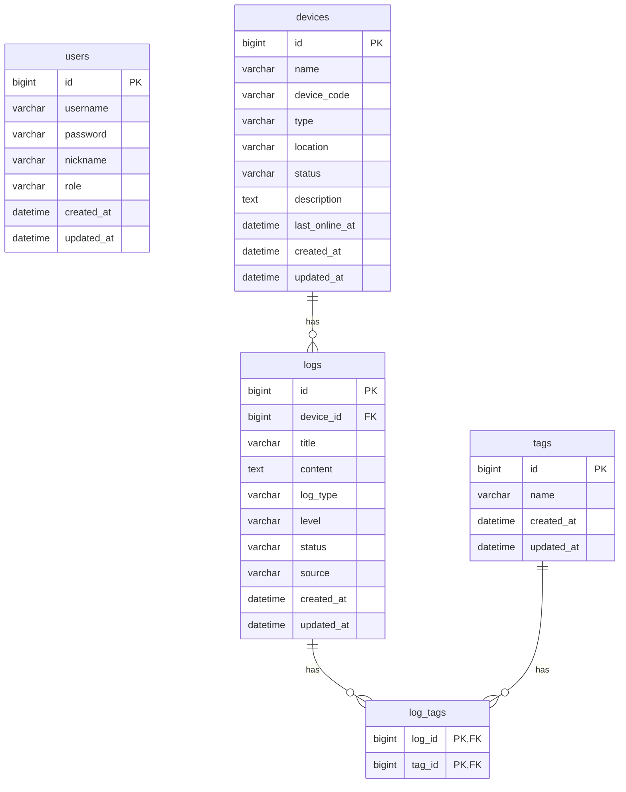

# AIoT 智能设备运行日志管理系统 - 数据库设计

## 1. 设计目标

数据库用于支撑第一阶段功能：

- 设备管理
- 日志管理
- 标签管理
- 日志筛选
- 首页统计

第一阶段不设计复杂权限、多租户、AI 分析结果和传感器明细数据表，但会保留后续扩展空间。

## 2. 数据库选型

推荐使用 MySQL 8.x。

字符集建议：

- 字符集：`utf8mb4`
- 排序规则：`utf8mb4_0900_ai_ci`

如果本地 MySQL 版本较低，不支持 `utf8mb4_0900_ai_ci`，可以改为 `utf8mb4_general_ci`。

## 3. 表结构总览

| 表名 | 中文名 | 说明 |
| --- | --- | --- |
| users | 用户表 | 第一阶段保留简单用户信息 |
| devices | 设备表 | 保存 AIoT 设备基础信息 |
| logs | 日志表 | 保存设备运行、异常、维护、巡检日志 |
| tags | 标签表 | 保存日志标签 |
| log_tags | 日志标签关联表 | 保存日志和标签的多对多关系 |

## 4. 表关系

关系说明：

- 一个设备可以有多条日志。
- 一条日志必须属于一个设备。
- 一条日志可以有多个标签。
- 一个标签可以被多条日志使用。

关系图：



## 5. 表字段设计

### 5.1 users

用户表。

第一阶段可以先不做登录，也可以作为后续登录功能预留。

| 字段名 | 类型 | 必填 | 说明 |
| --- | --- | --- | --- |
| id | BIGINT | 是 | 主键 |
| username | VARCHAR(50) | 是 | 用户名，唯一 |
| password | VARCHAR(255) | 是 | 密码，后续应保存加密后的密码 |
| nickname | VARCHAR(50) | 否 | 昵称 |
| role | VARCHAR(30) | 是 | 角色，默认 USER |
| created_at | DATETIME | 是 | 创建时间 |
| updated_at | DATETIME | 是 | 更新时间 |

### 5.2 devices

设备表。

用于保存 AI 小智和其他 AIoT 设备的基础信息。

| 字段名 | 类型 | 必填 | 说明 |
| --- | --- | --- | --- |
| id | BIGINT | 是 | 主键 |
| name | VARCHAR(100) | 是 | 设备名称 |
| device_code | VARCHAR(100) | 是 | 设备编号，唯一 |
| type | VARCHAR(100) | 是 | 设备类型 |
| location | VARCHAR(255) | 否 | 安装位置 |
| status | VARCHAR(30) | 是 | 当前状态 |
| description | TEXT | 否 | 设备描述 |
| last_online_at | DATETIME | 否 | 最后在线时间，第二阶段设备上报可使用 |
| created_at | DATETIME | 是 | 创建时间 |
| updated_at | DATETIME | 是 | 更新时间 |

设备状态：

| 编码 | 中文名 | 说明 |
| --- | --- | --- |
| NORMAL | 正常 | 设备运行正常 |
| ABNORMAL | 异常 | 设备存在异常 |
| OFFLINE | 离线 | 设备当前不可用或未连接 |
| MAINTENANCE | 维护中 | 设备正在维护 |

### 5.3 logs

日志表。

用于保存设备运行、异常、维护和巡检记录。

| 字段名 | 类型 | 必填 | 说明 |
| --- | --- | --- | --- |
| id | BIGINT | 是 | 主键 |
| device_id | BIGINT | 是 | 所属设备 ID |
| title | VARCHAR(200) | 是 | 日志标题 |
| content | TEXT | 是 | 日志内容 |
| log_type | VARCHAR(30) | 是 | 日志类型 |
| level | VARCHAR(30) | 是 | 日志等级 |
| status | VARCHAR(30) | 是 | 处理状态 |
| source | VARCHAR(30) | 是 | 日志来源 |
| created_at | DATETIME | 是 | 创建时间 |
| updated_at | DATETIME | 是 | 更新时间 |

日志类型：

| 编码 | 中文名 | 说明 |
| --- | --- | --- |
| RUNNING | 运行日志 | 记录正常运行情况 |
| ERROR | 异常日志 | 记录设备异常情况 |
| MAINTENANCE | 维护日志 | 记录维修、保养、更换模块等操作 |
| INSPECTION | 巡检日志 | 记录人工巡检情况 |

日志等级：

| 编码 | 中文名 | 说明 |
| --- | --- | --- |
| INFO | 普通 | 普通记录 |
| WARNING | 警告 | 需要关注 |
| ERROR | 严重 | 明确异常或影响使用 |

处理状态：

| 编码 | 中文名 | 说明 |
| --- | --- | --- |
| PENDING | 待处理 | 问题尚未处理 |
| PROCESSING | 处理中 | 问题正在处理 |
| RESOLVED | 已解决 | 问题已经解决 |

日志来源：

| 编码 | 中文名 | 说明 |
| --- | --- | --- |
| MANUAL | 手动录入 | 用户在后台手动填写 |
| DEVICE | 设备上报 | 第二阶段设备自动上报 |
| SYSTEM | 系统生成 | 第二阶段异常规则自动生成 |

### 5.4 tags

标签表。

用于保存日志标签。

| 字段名 | 类型 | 必填 | 说明 |
| --- | --- | --- | --- |
| id | BIGINT | 是 | 主键 |
| name | VARCHAR(50) | 是 | 标签名称，唯一 |
| created_at | DATETIME | 是 | 创建时间 |
| updated_at | DATETIME | 是 | 更新时间 |

默认标签建议：

- 异常
- 维修
- 实验
- 告警
- 已解决
- 网络
- 语音模块
- 传感器

### 5.5 log_tags

日志标签关联表。

用于实现日志和标签的多对多关系。

| 字段名 | 类型 | 必填 | 说明 |
| --- | --- | --- | --- |
| log_id | BIGINT | 是 | 日志 ID |
| tag_id | BIGINT | 是 | 标签 ID |

主键：

- `log_id`
- `tag_id`

删除规则：

- 删除日志时，自动删除对应关联关系。
- 删除标签时，自动删除对应关联关系。

## 6. 索引设计

### 6.1 devices

| 索引 | 字段 | 说明 |
| --- | --- | --- |
| uk_devices_device_code | device_code | 保证设备编号唯一 |
| idx_devices_status | status | 首页统计和列表筛选使用 |
| idx_devices_type | type | 设备类型筛选使用 |

### 6.2 logs

| 索引 | 字段 | 说明 |
| --- | --- | --- |
| idx_logs_device_id | device_id | 查询某设备日志 |
| idx_logs_log_type | log_type | 按日志类型筛选 |
| idx_logs_status | status | 按处理状态筛选 |
| idx_logs_level | level | 按日志等级筛选 |
| idx_logs_created_at | created_at | 按时间排序和筛选 |
| idx_logs_device_created | device_id, created_at | 查询某设备最近日志 |

### 6.3 tags

| 索引 | 字段 | 说明 |
| --- | --- | --- |
| uk_tags_name | name | 保证标签名称唯一 |

### 6.4 device_reports

| 索引 | 字段 | 说明 |
| --- | --- | --- |
| idx_device_reports_device_id | device_id | 按设备查询上报数据 |
| idx_device_reports_reported_at | reported_at | 按上报时间排序 |
| idx_device_reports_status | status | 按上报状态筛选 |
| idx_device_reports_device_reported | device_id, reported_at | 查询某设备最近上报 |

### 6.5 alert_rules

| 索引 | 字段 | 说明 |
| --- | --- | --- |
| idx_alert_rules_device_id | device_id | 查询某设备专属规则 |
| idx_alert_rules_enabled | enabled | 查询启用规则 |
| idx_alert_rules_metric | metric | 按指标筛选规则 |

## 7. 第二阶段新增表：device_reports

用于保存设备自动上报的传感器读数和运行状态。

| 字段 | 类型 | 说明 |
| --- | --- | --- |
| id | BIGINT | 主键 |
| device_id | BIGINT | 关联设备 ID |
| temperature | DECIMAL(8,2) | 温度，单位摄氏度 |
| humidity | DECIMAL(8,2) | 湿度，单位百分比 |
| voltage | DECIMAL(8,2) | 电压，单位伏 |
| signal_strength | INT | 信号强度，单位 dBm |
| status | VARCHAR(30) | 上报状态 |
| message | VARCHAR(500) | 上报说明 |
| reported_at | DATETIME | 设备上报时间 |
| created_at | DATETIME | 入库时间 |

命中异常规则时，后端自动写入 `logs` 表，`source = DEVICE`。

## 8. 第二阶段新增表：alert_rules

用于配置设备上报数据的异常判断规则。

| 字段 | 类型 | 说明 |
| --- | --- | --- |
| id | BIGINT | 主键 |
| name | VARCHAR(100) | 规则名称 |
| device_id | BIGINT | 设备 ID，空表示适用于全部设备 |
| metric | VARCHAR(30) | 指标：temperature、humidity、voltage、signalStrength |
| operator | VARCHAR(10) | 比较符：GT、LT、GTE、LTE、EQ |
| threshold_value | DECIMAL(10,2) | 阈值 |
| level | VARCHAR(30) | 告警等级 |
| enabled | TINYINT(1) | 是否启用 |
| created_at | DATETIME | 创建时间 |
| updated_at | DATETIME | 更新时间 |

设备上报时优先匹配启用的告警规则；如果没有任何启用规则，后端保留默认阈值作为兜底。

## 9. 首页统计对应 SQL 思路

设备总数：

```sql
SELECT COUNT(*) FROM devices;
```

异常设备数：

```sql
SELECT COUNT(*) FROM devices WHERE status = 'ABNORMAL';
```

待处理日志数：

```sql
SELECT COUNT(*) FROM logs WHERE status = 'PENDING';
```

最近维护记录：

```sql
SELECT *
FROM logs
WHERE log_type = 'MAINTENANCE'
ORDER BY created_at DESC
LIMIT 5;
```

最近异常日志：

```sql
SELECT *
FROM logs
WHERE log_type = 'ERROR'
ORDER BY created_at DESC
LIMIT 5;
```

## 10. 删除策略

设备删除策略：

- 第一阶段建议限制删除。
- 如果设备下存在日志，不允许删除设备。
- 这样可以避免误删日志数据。

日志删除策略：

- 允许删除日志。
- 删除日志时，通过外键级联删除 `log_tags` 中的关联数据。

标签删除策略：

- 允许删除标签。
- 删除标签时，通过外键级联删除 `log_tags` 中的关联数据。

设备上报删除策略：

- 当前阶段不提供删除上报记录接口。
- 如后续需要清理数据，建议按时间归档或增加管理员清理功能。

## 11. 后续扩展

第二阶段可以新增：

- `device_report_stats`：上报数据聚合统计表

第三阶段可以新增：

- `ai_analysis_records`：AI 分析记录表
- `ai_summary_records`：AI 总结记录表
